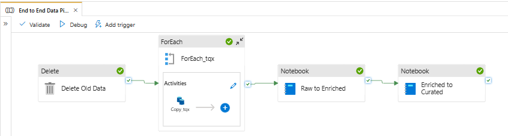
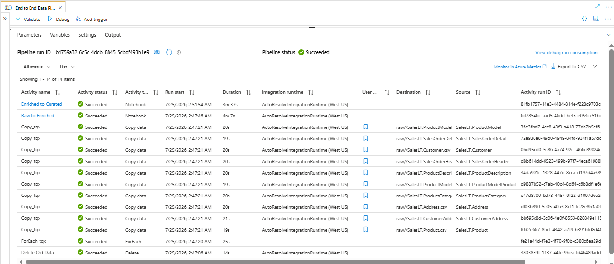
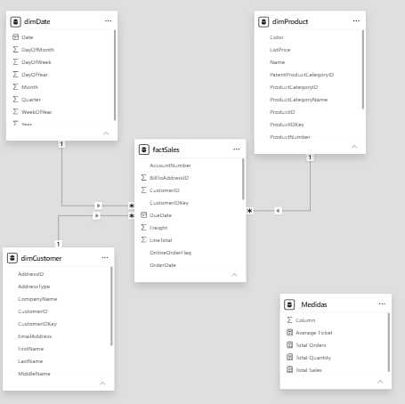
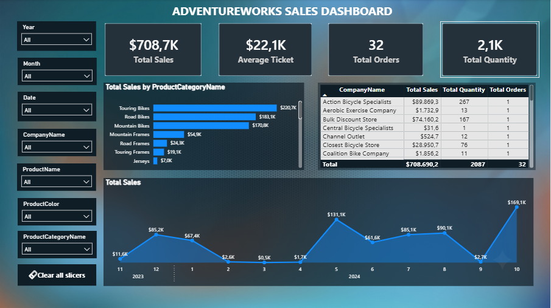

# 🚀 Azure Synapse Medallion Pipeline (AdventureWorks)

Este repositório contém a implementação de uma pipeline end-to-end de Engenharia de Dados desenvolvida no **Azure Synapse Analytics**, aplicando a **Medallion Architecture (Bronze, Silver e Gold)** com **Delta Lake** no **Azure Data Lake Storage Gen2 (ADLS Gen2)**.


O projeto realiza a ingestão paralela de dados a partir de um banco relacional **Azure SQL Database**, trata e padroniza as informações na camada Silver e constrói um modelo dimensional **Star Schema** na camada Gold via **PySpark**, deixando a estrutura pronta para análises e relatórios no **Power BI**.

---

## 🎯 Contexto de Negócio & Objetivos Analíticos

Mais do que uma solução técnica robusta em nuvem, este projeto foi desenhado para resolver um desafio clássico de negócio: **transformar dados operacionais (OLTP) de vendas e clientes em inteligência estratégica pronta para tomada de decisão.**

A base processada pertence ao ecossistema **AdventureWorks** (fabricante e distribuidora global de bicicletas, peças e acessórios). A estrutura dimensional criada na camada Gold (`curated`) permite responder diretamente às seguintes perguntas estratégicas:

- **Desempenho Comercial & Lucratividade:**
  - Qual é a Receita Total ($), Ticket Médio e Volume de Vendas por período?
  - Quais são os produtos e categorias mais rentáveis e de maior giro?
- **Inteligência de Clientes:**
  - Quem são os clientes de alto valor (*High-Value Customers*) e sua distribuição geográfica?
  - Como se comporta a taxa de recompra e o volume de pedidos por região?
- **Análise Temporal & Sazonalidade:**
  - Qual é a evolução histórica das vendas ao longo dos meses e anos (suportada pela `dimDate`)?
  - Existem picos sazonais de demanda para categorias específicas de produtos?

---

## 🏗️ Arquitetura da Solução

O fluxo de dados foi construído seguindo o padrão de pipeline end-to-end na nuvem:

| Etapa | Componente Principal | Descrição da Operação | Formato / Saída |
| :--- | :--- | :--- | :--- |
| **🛢️ Origem** | **Azure SQL Database** | Fonte de dados relacional (Schema `SalesLT`). | Tabelas OLTP |
| **🔄 Ingestão** | **Synapse Pipeline** | Execução de atividade `Delete` para idempotência e `ForEach` para cópia paralela. | Arquivos CSV (`raw/`) |
| **🥈 Silver** | **PySpark** *(Spark Pool)* | Limpeza de schemas, tratamento de colunas e simulação de datas históricas. | Tabelas Delta (`enriched/`) |
| **🥇 Gold** | **PySpark / Spark SQL** | Modelagem Star Schema com *Surrogate Keys* e Dimensão Calendário. | Tabelas Delta (`curated/`) |
| **📊 Consumo** | **Power BI / Analytics** | Camada final pronta para modelagem analítica e dashboards. | Dashboards & Reports |

---

## ⚙️ Tecnologias & Serviços Azure Utilizados

- **Azure Synapse Analytics:** Ambiente integrado para orquestração de pipelines e processamento Big Data.
- **Apache Spark Pool:** Cluster gerenciado para execução dos jobs de transformação em PySpark.
- **Azure Data Lake Storage Gen2 (ADLS Gen2):** Armazenamento em nuvem otimizado para analytics com namespace hierárquico.
- **Delta Lake:** Formato de armazenamento open-source que traz transações ACID e alto desempenho para o Data Lake.
- **Azure SQL Database:** Banco de dados relacional de origem (Base de testes AdventureWorks LT).
- **Azure RBAC & Managed Identity:** Controle de acesso unificado e seguro entre serviços sem exposição de chaves.

---

## 🗄️ Estrutura do Data Lake & Arquitetura Medalhão

### 1. Camada Raw / Bronze (`raw/`)
- **Formato:** CSV
- Contém a ingestão bruta das 10 tabelas do schema `SalesLT` (`SalesLT.Customer.csv`, `SalesLT.Product.csv`, `SalesLT.SalesOrderHeader.csv`, etc.).

### 2. Camada Enriched / Silver (`enriched/`)
- **Formato:** Delta Lake
- Processamento via notebook PySpark `01_raw_to_enriched`:
  - Limpeza de colunas desnecessárias e renomeação de atributos.
  - Randomização de datas na coluna `OrderDate` para simular massa histórica real.
  - Salvamento como tabelas **Delta Lake**: `salesCustomer`, `salesCustomerAddress`, `salesOrderHeader`, `salesOrderDetail`, `salesProduct`, `salesProductCategory`.

### 3. Camada Curated / Gold (`curated/`)
- **Formato:** Delta Lake (Modelo Dimensional Star Schema)
- Processamento via notebook PySpark `02_enriched_to_curated`:
  - Criação de *Surrogate Keys* (`monotonically_increasing_id()`).
  - Geração dinâmica da Dimensão Tempo (`dimDate`).
  - Criação das tabelas no formato **Delta Lake**:
    - **`dimCustomer`**: Dimensão Cliente tratada com endereço e chave substituta.
    - **`dimProduct`**: Dimensão Produto consolidada com categoria e subcategoria.
    - **`dimDate`**: Dimensão Calendário cobrindo o período de análises.
    - **`factSales`**: Tabela Fato de Vendas combinando cabeçalho e itens de pedidos com as chaves das dimensões.

---

## 📊 Validação e Histórico de Execução

O pipeline foi homologado com 100% de taxa de sucesso (`Succeeded`) em todas as 14 atividades no Azure Synapse Analytics:

### Fluxo e Execução das Atividades


### Monitoramento e Performance Detalhada


- **Limpeza (`Delete Old Data`):** Executada com sucesso para garantir a idempotência do pipeline.
- **Cópia Concorrente (`Copy_tqx` no `ForEach`):** Média de ~20s por tabela via Integration Runtime.
- **Job PySpark (Raw -> Enriched):** Concluído em 4m 07s.
- **Job PySpark (Enriched -> Curated):** Concluído em 3m 37s.

---

## 📊 Camada de Apresentação & Business Intelligence (Power BI)

A camada Gold (`curated`) do Data Lake foi disponibilizada via **Synapse Serverless SQL Pool** e conectada ao **Power BI Desktop** para a construção de um painel executivo e interativo de vendas.

---

### 📐 Modelagem Dimensional (Star Schema)

No Power BI Desktop, as views do Synapse foram conectadas e organizadas em uma estrutura **Star Schema (1 para Muitos)**, garantindo integridade relacional, alta performance analítica e cálculo eficiente de medidas DAX:



- **Tabela Fato (`factSales`):** Centralizada com métricas financeiras e chaves substitutas (*Surrogate Keys*).
- **Tabelas de Dimensão (`dimCustomer`, `dimProduct`, `dimDate`):** Entidades contextuais ligadas à fato pelas chaves relacionais (`customerKey`, `productKey`, `dateKey`).

---

### 🎨 Dashboard Executivo

O painel foi desenvolvido com um layout corporativo escuro (*Dark Tech*), organizando os visuais em blocos para rápida leitura dos indicadores do negócio:



---

### 🎥 Demonstração Interativa

Confira a navegação em tempo real e a aplicação dos filtros dinâmicos no relatório:

[](dashboard/demo_adventureworks_dashboard.mp4)

> 💡 *Clique na imagem acima para abrir e assistir à demonstração interativa em vídeo.*
---

### 🎯 Destaques e KPIs do Painel

- **Métricas de Alto Nível (KPIs):** Acompanhamento do Faturamento Total ($708,7K), Ticket Médio ($22,1K), Total de Pedidos (32) e Volume de Unidades (2,1K).
- **Análise de Portfólio:** Ranking de vendas por categoria de produto (com destaque para *Touring Bikes* e *Road Bikes*).
- **Evolução Temporal:** Análise histórica da curva de faturamento mês a mês.
- **Performance por Cliente:** Tabela analítica agrupando vendas e quantidade de pedidos por empresa parceira.
- **Segmentação Dinâmica:** Slicers interativos por ano, mês, data, cliente, produto e categoria.

---

## 📁 Estrutura do Repositório

```text
azure-synapse-medallion-adventureworks/
│
├── README.md                          # Documentação principal
│
├── architecture/
│   ├── pipeline_canvas.png            # Interface do Synapse com o pipeline em destaque
│   ├── pipeline_flow.png              # Fluxo visual das atividades concluídas
│   └── pipeline_execution.png         # Monitoramento detalhado das execuções (Status Succeeded)
│
├── notebooks/
│   ├── 01_raw_to_enriched.ipynb       # Código PySpark (CSV -> Delta na Silver)
│   └── 02_enriched_to_curated.ipynb   # Código PySpark (Modelagem Star Schema na Gold)
│
└── pipelines/
    └── End_to_End_Data_Pipeline.json  # Definição do Pipeline exportada do Synapse
```

## 👨‍💻 Autor
**Daniel Moreira** | Data Engineer
